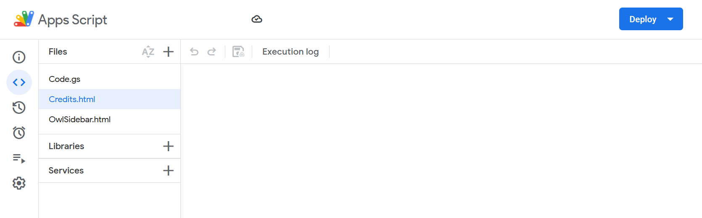
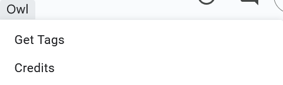

# Instructions

[Owl](https://github.com/gongahkia/owl) reference manual.

1. [Installation instructions](#installation)
2. [Colorscheme configuration instructions](#colorscheme-configuration)

## Installation

[Owl](https://github.com/gongahkia/owl) extensions all begin installation the same way.

1. Open [google editor suite](https://workspace.google.com/) application.
2. Select `Extensions > Apps Script`.


3. Replace the code in `Code.gs`.


4. Create a file called `OwlSidebar.html` and add the code.


5. Create a file called `Credits.html` and add the code.



6. `Ctrl + s` to save the project.
7. Navigate to your google editor. 
8. `Ctrl + r` to reload your google editor.
9. Select `Owl > Get Tags` from the extensions topbar.



10. Select `OK` to give permissions.


11. Choose a Google Account to associate with the script.


12. Select `Show Advanced > Go to Untitled project (unsafe)`.


13. Select `Allow`.


## Colorscheme configuration

Personalise [Owl](https://github.com/gongahkia/owl).

1. Refer to [`README.md`](./README.md#colorschemes) for supported colorschemes.
2. Open [google editor suite](https://workspace.google.com/) application.
3. Select `Extensions > Apps Script`.


4. Scroll to the bottom of `Code.gs` and replace the colorscheme identifier in the below line with your desired colorscheme.

```js
return { prefixes, tags, colorscheme<COLORSCHEME_NAME> };
```


5. `Ctrl + s` to save the edited code.
6. Replace the colorscheme identifier in the below line in `OwlSidebar.html` with your desired colorscheme.

```js
const colors = data.colorscheme<COLORSCHEME_NAME>;
```


7. `Ctrl + s` to save the edited code.
8. Navigate to your google editor. 
9. `Ctrl + r` to reload your google editor.