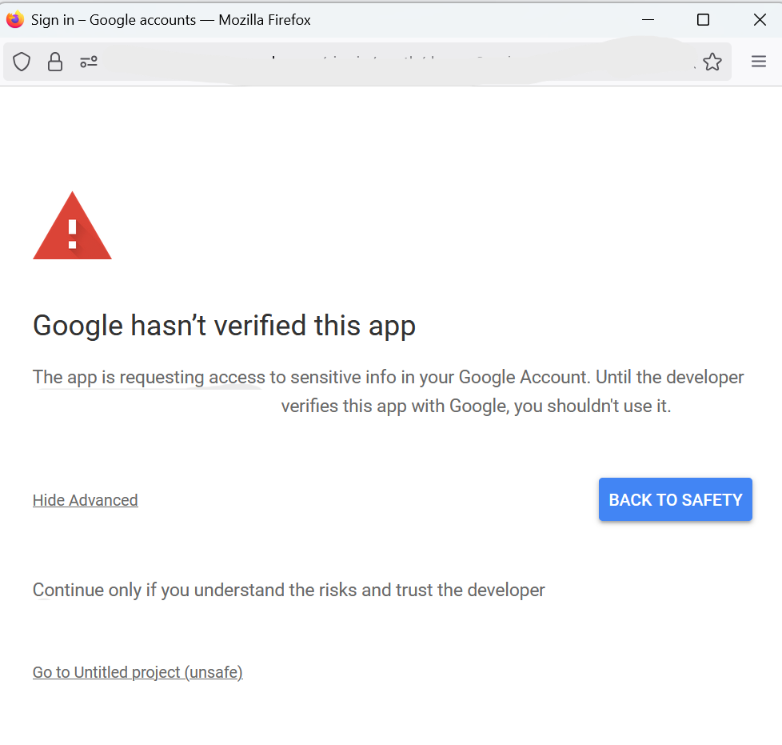

# Instructions

[Owl](https://github.com/gongahkia/owl) extensions all begin installation the same way.

1. Open [google editor suite](https://workspace.google.com/) application.
2. Select `Extensions > Apps Script`.

3. Replace the code in `Code.gs`.

4. Create a file called `OwlSidebar.html` and add the code.

5. `Ctrl + s` to save the project.
6. Navigate to your google editor. 
7. `Ctrl + r` to reload your google editor.
8. Select `Owl` from the extensions topbar.
9. Select `OK` to give permissions.

10. Choose a Google Account to associate with the script.

11. Select `Show Advanced > Go to project_name (unsafe)`.

12. Select `Allow`.

