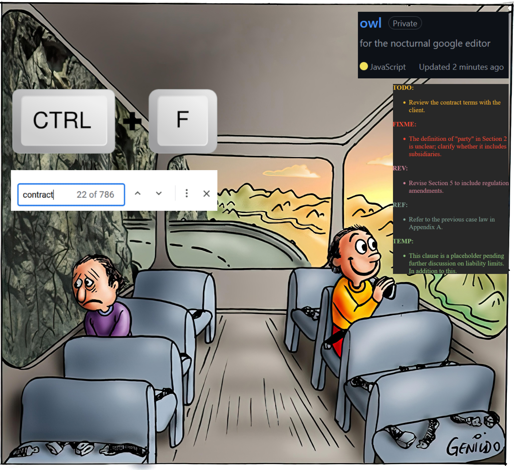

> [!IMPORTANT]  
> Please read through [this disclaimer](#disclaimer) before using [Owl](https://github.com/gongahkia/owl).  

# `Owl` 🦉

Watches your google editors.

[Owl](https://github.com/gongahkia/owl) is a highly [customisable](#colorschemes), [extensible](#configurations) extension that monitors, collates and organises [your tags](#tags) on your google editors.

It works for Google [docs](#docs-owl), [sheets](#sheets-owl) and [slides](#slides-owl).

## Rationale

Since I started taking law modules in August 2023, I've found it necessary to flag specific cases, rulings and analysis for later review, rework, or revision.

Resultingly, I have more than once found myself wishing for native support for [code annotations](https://docs.github.com/en/contributing/writing-for-github-docs/annotating-code-examples) *(especially [those](https://medium.com/@wcpines/using-comment-annotations-cd06415ef71a) in the TODO, FIXME, NOTE, TBD family)* within the Google editor suite. Another close analogue would be Vim [marks](https://vim.fandom.com/wiki/Using_marks), addressed by the [ThePrimeagen](https://www.youtube.com/c/theprimeagen)'s fantastic marks manager, [Harpoon](https://github.com/ThePrimeagen/harpoon).

However, the closest I could ever get to replicating that experience in Google Editors was finding with `Ctrl + F`, or commenting with `Ctrl + Alt + M`.

Importantly, I needed a frictionless solution that complemented my existing notetaking workflow and did not slow me down by requiring learning a new keybind.

With these considerations in mind, I created [Owl](https://github.com/gongahkia/owl).

## Screenshot

### Docs Owl

### Sheets Owl

### Slides Owl

## Tags

The below tags are currently supported.

| Tag | Purpose | Example |
| :--- | :--- | :--- |
| `TODO` | Task to be completed in the future |  |
| `FIXME` | Signposts areas that require explicit urgent attention  |  |
| `REV` | Signposts areas that require less urgent revision |  |
| `TEMP` | Denotes temporary placeholder text |  |
| `REF` | Points to a reference, generally to more detailed documentation, resources or bibliography |  |

> [!TIP]  
> More tags *(or custom tags)* might be added in the future. Open an issue to feedback!

## Colorschemes

Find instructions to change your colorscheme [here](#configurations).

| Colorscheme | Example |
| :--- | :---: |
| Gruvbox |  |
| Everforest |  |
| Tokyo Night |  |
| Atom Dark |  |
| Monokai |  |
| Github |  |
| Ayu |  |
| Dracula |  |
| Rose Pine |  |
| Spacemacs |  |

## Configurations

For detailed installation and configuration instructions, see [`INSTRUCTIONS.md`](./INSTRUCTIONS.md).

## Deployment 

| Editor platform | Status | Link | 
| :--- | :--- | :--- |  
| [Google Docs](./src/docs/) |  | [docs.google](https://docs.google.com) |
| [Google Sheets](./src/sheets/) |  | [sheets.google](https://sheets.google.com) |
| [Google Slides](./src/slides/) |  | [slides.google](https://slides.google.com) |
| Google Workspace Marketplace |  | [workspace.google.com/marketplace](https://workspace.google.com/marketplace/search/) |

## Disclaimer

The `Owl` extension is provided "as is" and without any warranties of any kind, either express or implied, including but not limited to implied warranties of merchantability, fitness for a particular purpose, or non-infringement.

By using this extension, you acknowledge and agree to the following:

1. **No Liability for Malfunction**: The developer of the `Owl` extension shall not be liable for any direct, indirect, incidental, special, consequential damages, or any damages whatsoever arising out of or in connection with the use of this extension. This includes but is not limited to:

    * Data loss
    * Corruption of files
    * Interruption of service
    * Any other issues that may arise as a result of using this extension

2. **User Responsibility**: You are solely responsible for ensuring that you have adequate backups of your data and that you understand the risks associated with using this extension. 

3. **Compliance with Laws**: You are responsible for ensuring compliance with all applicable laws and regulations regarding the use of this extension and any data it may process.

4. **Modification and Updates**: The developer reserves the right to modify or discontinue the extension at any time without notice. The functionality may change over time, and while efforts will be made to keep it stable, no guarantees are made regarding its performance.

5. **Third-Party Services**: The `Owl` extension interacts with third-party services (such as Google Docs, Sheets, and Slides). The developer is not responsible for any issues arising from these interactions or from changes in third-party services.

6. **Indemnification**: You agree to indemnify and hold harmless the developer from any claims, losses, liabilities, damages, costs, or expenses (including reasonable attorney fees) arising out of your use of this extension.

7. **Disclaimer changes**: This disclaimer is subject to change without notice. Please review it periodically for updates.

## References

The name `Owl` is in reference to the [second technique](https://kagurabachi.fandom.com/wiki/Seiichi_Samura#Techniques) of [Tobimune](https://kagurabachi.fandom.com/wiki/Enchanted_Blade#Tobimune) (飛宗), the [enchanted blade](https://kagurabachi.fandom.com/wiki/Enchanted_Blade) wielded by the contracted sword bearer [Seiichi Samura](https://kagurabachi.fandom.com/wiki/Seiichi_Samura) (座村清市) during the [Seitei War](https://kagurabachi.fandom.com/wiki/Seitei_War). [Owl](https://kagurabachi.fandom.com/wiki/Seiichi_Samura#Techniques) first appears during the [Sword Bearer Assassination arc](https://kagurabachi.fandom.com/wiki/Sword_Bearer_Assassination_Arc) of the manga series [Kagurabachi](https://kagurabachi.fandom.com/wiki/Kagurabachi_Wiki).

