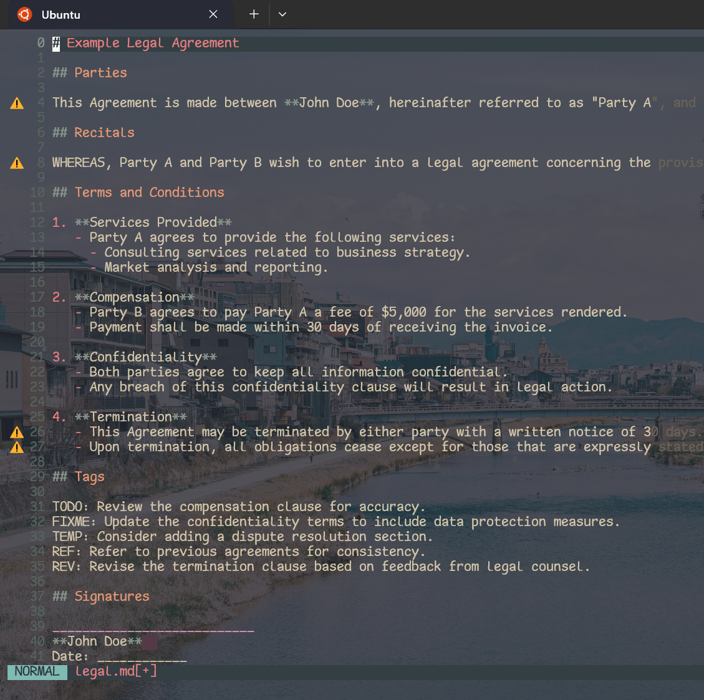
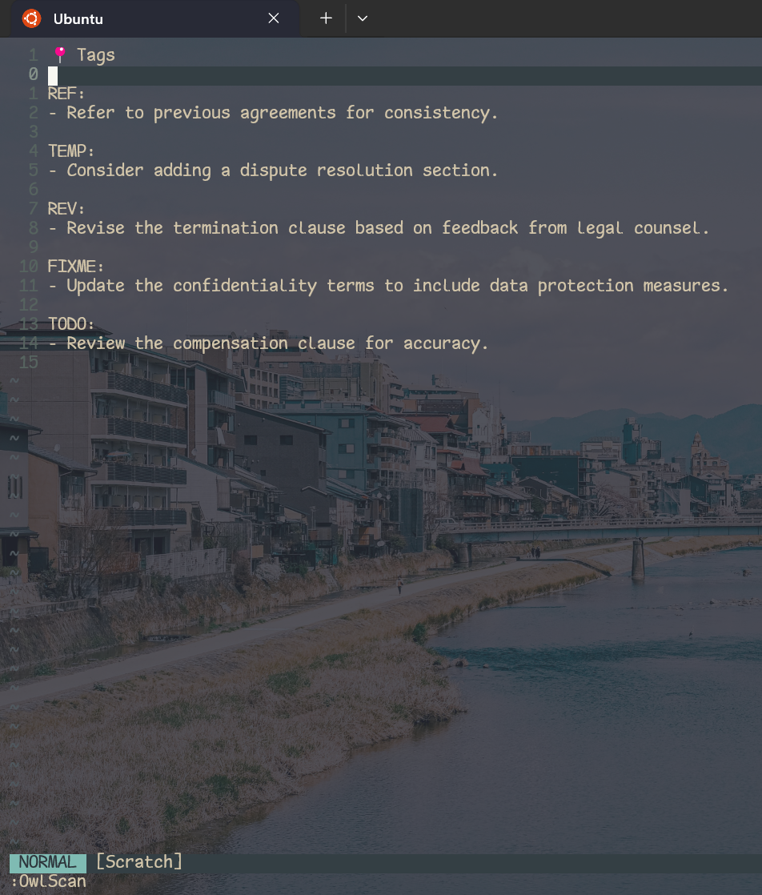
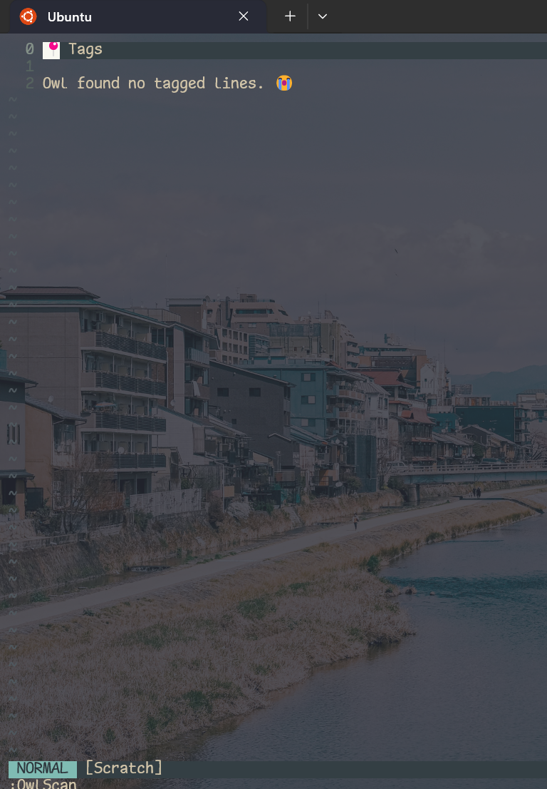

# [`Owl`](https://github.com/gongahkia/owl/tree/main/src/vim) in Vim

Thrown together in an hour to provide Owl's core functionality for any [plain text](https://en.wikipedia.org/wiki/Plain_text) file format. 

Released alongside .

## Usage

Instructions below are for those using [Vim](https://www.vim.org/) on UNIX systems.

1. Place [`owl.vim`](./owl.vim) at the filepath `~/.vim/pack/plugins/start/vim-owl/plugin/owl.vim`.
2. Type `:OwlScan` to run

## Screenshot

